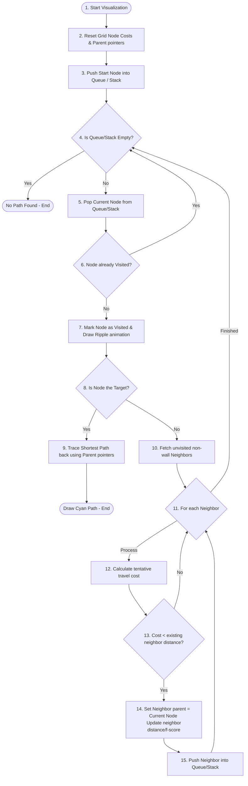

# Algoverse: Interactive Pathfinding & Maze Engine

An interactive, real-time sandbox engine designed to visualize, analyze, and compare classic graph traversal and heuristic search algorithms. Built with vanilla HTML5, modern CSS3 variables/animations, and ES6+ JavaScript.

🌌 **Live Sandbox Visualizer & Presentation Deck**

---

## 🚀 Key Features

1. **Pathfinding Solvers**:
   - **A* Search**: Optimal heuristic-guided solver using Manhattan distances and customized binary heap sorting.
   - **Dijkstra's Algorithm**: Concentric uniform cost weighted explorer.
   - **Breadth-First Search (BFS)**: Unweighted wavefront solver. Optimal for step counts.
   - **Depth-First Search (DFS)**: Stack-based explorer. Winding paths.

2. **Maze & Terrain Engineering**:
   - **Recursive Division**: Generates organized grids and hallways recursively.
   - **Randomized DFS Carver**: Carves winding, single-solution labyrinths.
   - **Random Noise**: Randomly scatters walls or weighted swamp node pools.

3. **Interactive UI Sandbox**:
   - **Paintbrushes**: Click and drag to paint Walls or weighted Swamps (cost of 5).
   - **Instant Recalculation**: Drag start/target nodes after solving to watch paths warp dynamically in 0ms.
   - **Diagnostics Board**: Real-time trackers for Time (ms), Visited Nodes, Path Length, and Path Cost.
   - **🎓 Presentation Slides View**: An 8-slide presentation built directly into the website with a logo on the top right, customizable student name inputs, and Left/Right keyboard arrow navigation.

---

## 📋 Algorithm Complexity Profile

| Algorithm | Time Complexity | Space Complexity | Path Optimality |
| :--- | :--- | :--- | :--- |
| **A\* Search** | $O((V + E) \log V)$ | $O(V)$ | Yes (Guaranteed) |
| **Dijkstra's** | $O((V + E) \log V)$ | $O(V)$ | Yes (Guaranteed) |
| **BFS** | $O(V + E)$ | $O(V)$ | Yes (Unweighted steps) |
| **DFS** | $O(V + E)$ | $O(V)$ | No |

---

## 🛠️ Step-by-Step Flowchart



---

## 💻 Local Setup & Execution

Since the project is built with zero framework dependencies, running it is simple:

1. Clone this repository:
   ```bash
   git clone https://github.com/kirancodes-dev/DAA.git
   ```
2. Open the directory:
   ```bash
   cd DAA
   ```
3. Open `index.html` directly in your browser, or spin up a simple server:
   ```bash
   # Using Python
   python3 -m http.server 8123
   
   # Using Node.js
   npx http-server -p 8123
   ```
4. Access the web app at `http://localhost:8123`.
